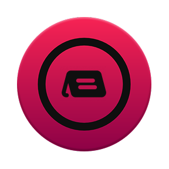

<p align="center"></p>

<h1 align="center">CiderDeck</h1>

<p align="center">The official Stream Deck plugin for the <a href="https://cider.sh">Cider</a></p>

Control playback, see what's playing, manage your queue and library, flip audio settings, and run a full Stream Deck + setup, all from your deck. CiderDeck talks to Cider's local API, so everything stays in sync with the app as it happens.

This is a ground-up rebuild of the original CiderDeck on Elgato's current Node SDK and Cider's V2 API. It installs as an update, so any buttons you already placed keep working.

## What it does

### Playback

Play/pause, next, previous, shuffle, and a three-state repeat. Put the album cover on a key, or use the Album Art Grid to spread one cover across a 2x2 (or any sized) block. The song-display tile scrolls long titles and is configurable.

### Library and rating

Favorite, dislike, and add-to-library keys that always reflect the current track's real state.

### Audio

Toggle Atmos, Crossfade, and Automix, and cycle the Listening Mode between Off, Gaming, and Unwind.

### Queue

Clear the queue with a two-press confirm, flip the Smart Queue optimizer, and scroll the up-next queue as a coverflow on the Stream Deck + touchscreen.

### Pins

Pin a playlist, album, or station to a key and start it in one press, shuffled if you like. Pick it from a searchable library window instead of pasting an id.

### Stream Deck +

The playback dial puts the whole player on one encoder:

- Rotate to seek or change volume, press to switch which.
- A strip of status icons under the title for favorite, library, shuffle, and repeat.
- Tap the screen edges to skip, the middle to play/pause.
- Hold the screen or the dial for an action wheel where every entry shows its live state, and repeat cycles in place.

### Settings in one place

Connection details and per-tile options live in a single window styled to match Stream Deck, with a tab for every tile you have placed.

## Requirements

- Cider 4.0+ with it's RPC API enabled
- Stream Deck software 6.5 or newer
- Any Stream Deck, including Mini, XL, and Stream Deck +

## Setup

1. Install from the Elgato Marketplace, or drop the `.streamDeckPlugin` onto the Stream Deck app.
2. Drag a Cider tile onto a key.
3. Open its inspector, click the gear, and choose **Authorize with Cider**. Approve the prompt in Cider and you are connected.

Every tile shares that one connection, so you only authorize once.

## Build from source

```sh
npm install
npm run build
npx streamdeck restart sh.cider.streamdeck
```

The packaged plugin lives in `sh.cider.streamdeck.sdPlugin/`.

## Credits

Made by [Cider Collective](https://cider.sh), built with the [@elgato/streamdeck](https://github.com/elgatosf/streamdeck) SDK.
